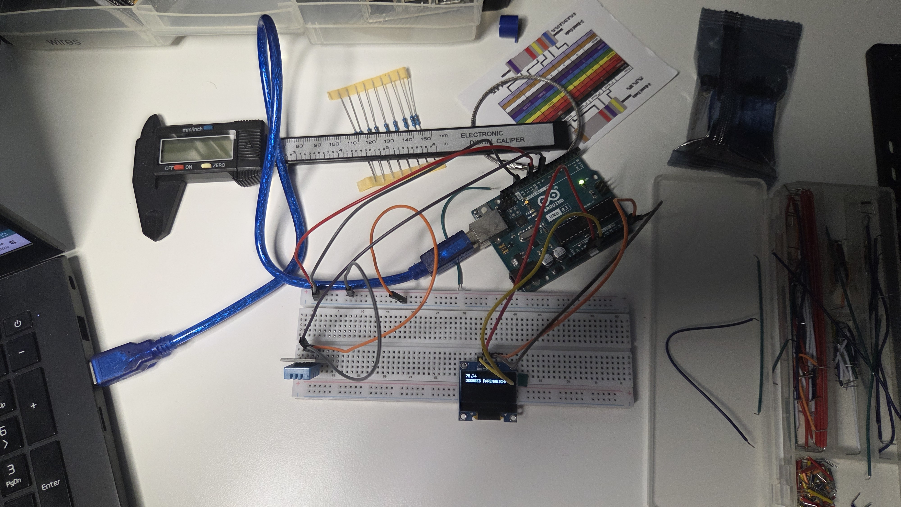

# arduino_temp_lcd

Temperature watch with LCD display 

The Arduino OLED Climate Monitor is an embedded systems project designed to provide real-time, localized environmental monitoring. Utilizing a DHT11 digital sensor and a 0.96-inch SSD1306 OLED display, the system accurately samples ambient temperature and relative humidity, processing the data through an Arduino microcontroller to display crisp, updated readings. This project serves as a foundational building block for smart home automation, greenhouse regulation, and localized weather station nodes.

## CLEAN DIAGRAM

## HARDWARE
* ARDUINO UNO
* DHT11
* 0.96 OLEDDISPLAY
